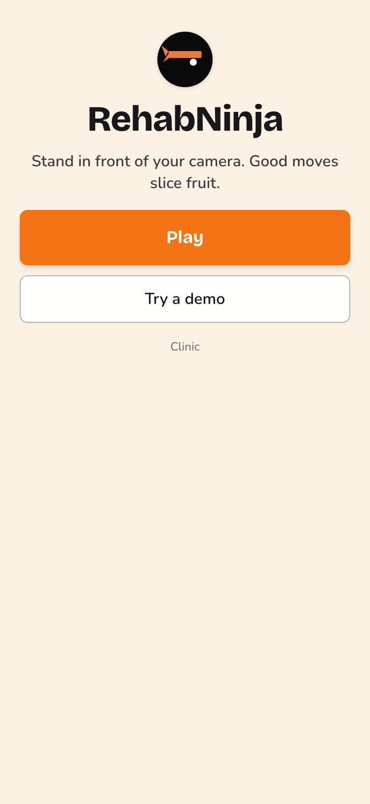
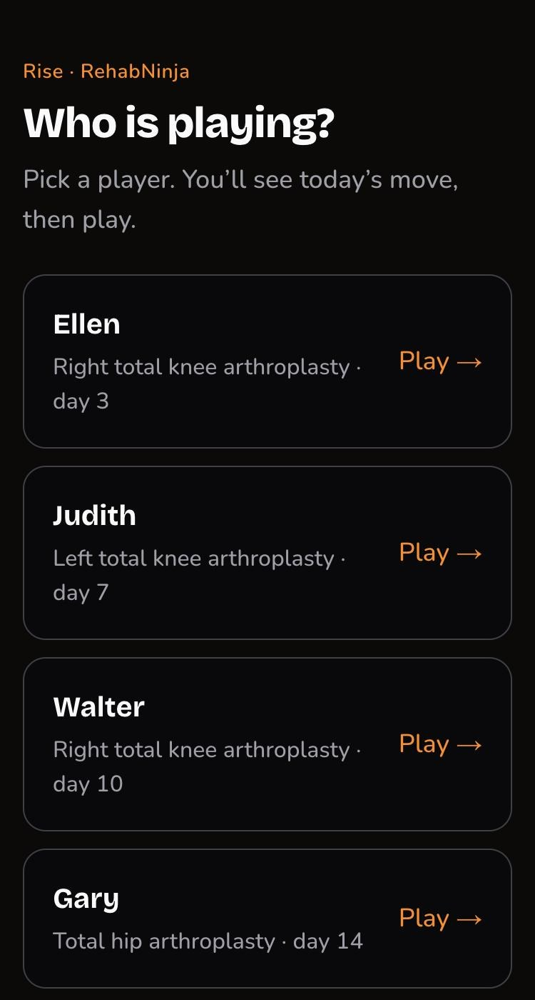
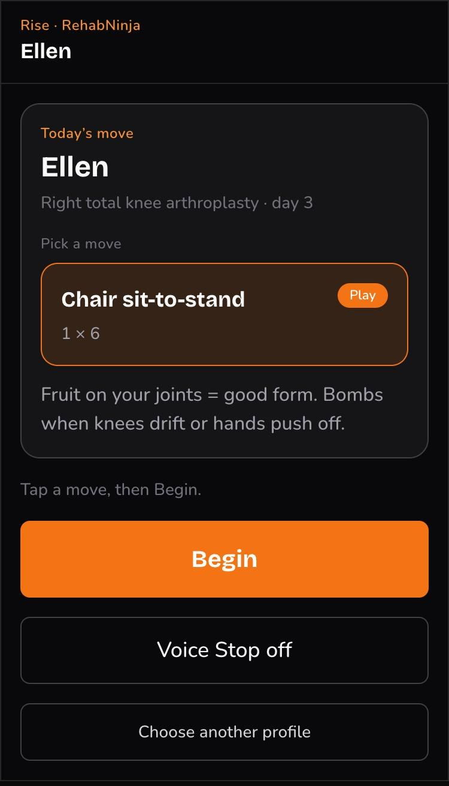
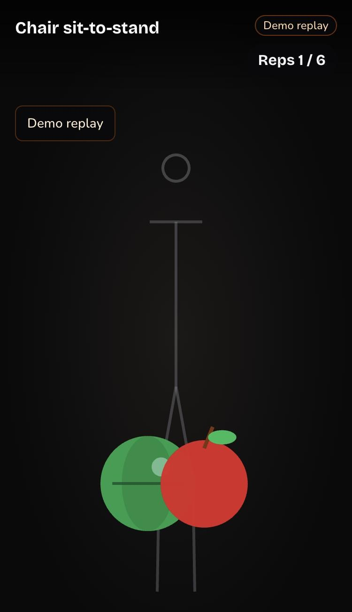
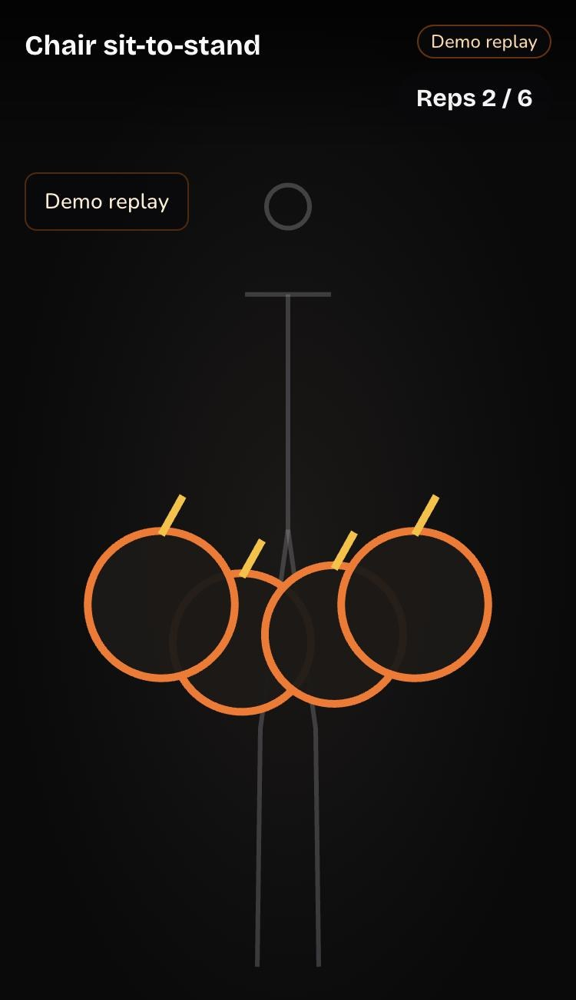
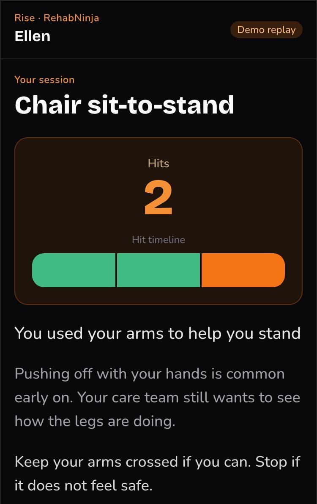
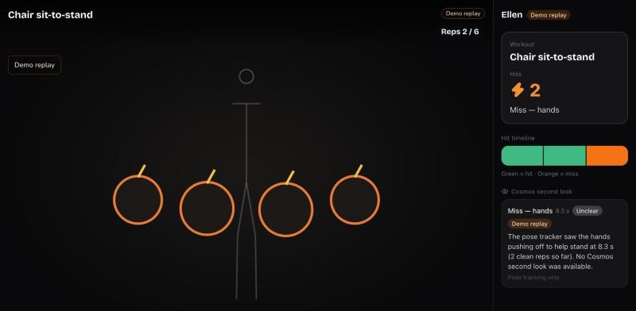

# Rise · RehabNinja

**Post-op rehab you play on your phone.** Stand in front of the camera, do today's assigned move, and good reps slice fruit. When a knee drifts in or your hands push off the chair, the fruit turns into a bomb. Behind the game, the same pose tracking measures the CDC-standard chair stand, so the care team sees real numbers while the patient only ever sees hits and misses.

Built for the Real-Time Video Agents Hack – NYC (VAST Builders Challenge). All patient data is synthetic.

**Live demo:** https://rise.nextrex.health (served from the demo laptop through a Cloudflare tunnel; up only while it runs). Try **Try a demo** for Ellen's scripted session, no camera needed.

<p>
  
  
  
</p>
<p>
  
  
  
</p>

## How a session plays

1. **Pick a player.** Seven synthetic patients after knee or hip replacement or hip-fracture repair, each on their own post-op day.
2. **Today's move.** The program assigns a move for that patient's recovery stage: chair sit-to-stand, mini squat, or single-leg balance.
3. **Play.** The phone tracks the body on-device. Clean reps slice the fruit on your joints; form breaks (knees caving in, moving too fast, pushing off with your hands, leaning to one side) become bombs. A voice coach (ElevenLabs) and captions guide every step, and Stop is always on screen.
4. **Four quick questions.** Pain, dizziness, shortness of breath or chest pain, calf pain or swelling. A yes to breath or chest pain goes straight to call-911 instructions.
5. **Session report.** Hits and a hit timeline, plus one plain-language correction ("You used your arms to help you stand", what it means, what to try next). Never a clinical score.

## YOLO detects, Cosmos verifies

The game reacts instantly because YOLO runs on the phone. Every time YOLO flags a form break (knees caving, too fast, hands pushing off, leaning) or loses tracking, Rise also sends the last ~2 seconds of camera frames to **NVIDIA Cosmos** (`cosmos3-nano-reasoner`, the event's NIM) for a second look. The clinic strip shows whether Cosmos confirms what YOLO saw, what it observed, and "Needs a human look" if anything looks unsafe. With four 448 px frames, Cosmos answers in about 1.3–3.6 s.

<p>
  
</p>

The screenshot is Ellen's demo replay, which has no camera frames, so the entry is the pose-only fallback, badged "Demo replay". With the live camera, the entry is Cosmos's own reply. Here's a real one from the event endpoint, run on a still frame where there's no motion to judge:

```json
{
  "verdict": "unclear",
  "observation": "The frames show a stick figure in a chair sit-to-stand exercise with green and red circles indicating the knees and hips. The figure remains seated in all visible frames, with no clear movement toward standing or any visible hand position on the chest or thighs.",
  "compensations": [],
  "steadiness": "steady",
  "safetyConcern": false,
  "uncertainty": "No movement is visible across the frames; the figure remains seated, making it impossible to confirm or deny the flagged hand position.",
  "model": "nvidia/cosmos3-nano-reasoner",
  "latencyMs": 1612,
  "demoData": false
}
```

Cosmos is care-team only. It never changes hits, bombs, or triage, and never talks to the patient.

## Why a game

After a joint replacement, the day-7 phone call hears "I'm fine," and functional decline goes unseen until the next visit or the ED. Patients (often 60–80, alone, with one phone) won't fill in forms, but they will play two minutes of a game. Rise turns the standard test into that game:

| What the patient sees | What the care team gets |
| --- | --- |
| Fruit, bombs, reps toward a target | CDC STEADI 30-Second Chair Stand: raw stands, the arm-use rule (score 0 if arms are used), knee asymmetry, pauses |
| "Today seemed harder than last time" | The trend against the patient's own last check-in |
| One friendly correction | Which form break fired, and when |
| Nothing scary | Deterministic triage: escalate, nurse callback, or continue the plan, routed to surgeon, primary care, or PT |

The recommendation always comes from written rules (`lib/rules.ts`), never a model, and a person approves every escalation. Patient-facing text comes only from locked copy files, written to SAMHSA's trauma-informed principles.

## Two ways in

- **RehabNinja** (`/` → `/play`): the game, above.
- **Classic check-in** (`/p/rise-01`): the same test as a voice-led, no-game flow (P1–P5): safety checks and framing, spoken CDC instructions, a 30-second chair stand, four questions, closing lines. **Use demo recording** replays a patient's session without a camera.

## Under the hood

```
Phone camera ──> pose on-device (YOLO11n-pose ONNX via WebGPU/WASM, MediaPipe fallback)
             ──> stand counter / form findings ──> fruit, bombs, reps (RehabNinja)
                                               ├─> on a form break: last ~2 s of frames ──> Cosmos (cosmos3-nano-reasoner) second look ──> clinic strip
                                               └─> CDC score + deterministic triage rules
Voice: ElevenLabs lines pre-rendered to public/voice (hash-keyed; browser speech fallback)
Hosting: Next.js on the demo laptop ──> Cloudflare Tunnel ──> rise.nextrex.health
```

- **Pose tiers:** YOLO is kept only at 15 fps or more on the phone (benchmarked: 16.6 fps WebGPU on Rex's phone); MediaPipe is preloaded and takes over mid-set if YOLO drops under 12 fps for 2 s; a demo replay drives the same code with no camera.
- **Counter:** knee angle plus hip rise with hysteresis, the CDC half-way rule at 30 s, arm-use, mid-rise asymmetry, pauses. Unit-tested against all seven seed patients.
- **Cosmos second look:** YOLO detects, Cosmos verifies. When YOLO flags a form break or loses tracking during live play, the last ~2 s of camera frames (4 downscaled JPEGs, never stored) and YOLO's numbers go to Cosmos (`nvidia/cosmos3-nano-reasoner` on the event's NVIDIA NIM) through `POST /api/cosmos/second-look`. The clinic strip shows whether Cosmos confirms what YOLO saw, what it observed, and "Needs a human look" on anything unsafe. It is care-team only and never changes hits, bombs, or triage. It uses an OpenAI-compatible endpoint with a bearer token (`COSMOS_BASE_URL`, `COSMOS_API_KEY`, `COSMOS_MODEL` in `.env.local`; check with `npm run cosmos:probe`), with a pose-only fallback badged "Demo data" when Cosmos is unavailable or in demo replay.
- **Built, not yet wired:** a W&B agent note (Weave-traced), VAST clip ingest and semantic search, Twilio invites, and the live clinic console have typed contracts (`lib/types.ts`) and stubs in `lib/ai/` and `lib/adapters/`, but no live calls yet.

## Run it

```bash
npm install
cp .env.example .env.local   # optional; the demo runs without keys
npm run dev -- -p 3400        # http://localhost:3400
npm run check                 # typecheck + tests
npm run voice                 # re-render changed voice lines (needs ELEVENLABS_* in .env.local)
npm run cosmos:probe          # check the Cosmos endpoint: model, latency, one real second look
npm run tunnel:named          # https://rise.nextrex.health -> :3400 (named tunnel "rise")
bash scripts/install-tunnel-service.sh  # same tunnel as a login service (survives restarts)
```

Phone camera access needs HTTPS, so test on a phone through the tunnel. The YOLO model (`public/models/pose.onnx`) is not committed; export it with `scripts/export_pose_onnx.py` (version pins for Intel Macs are in [docs/PREFLIGHT.md](docs/PREFLIGHT.md)). Without it, RehabNinja uses MediaPipe.

Dev pages: `/dev/pose` (fps benchmark per tier) and `/dev/fixtures` (record keypoint fixtures for the demo replay).

## The players

Seven synthetic patients from [seed/patients.json](seed/patients.json) (see [seed/README.md](seed/README.md)): Ellen Marsh (hero: arms from rep 2, short of breath), Judith Kerr, Walter Brandt, Gary Lindqvist, Diane Coulter, Ruth Abernathy, Harold Pruitt. Each scenario echoes the next real event in the source chart, so their expected triage doubles as the test oracle.

## Limitations

- Remote, phone-scored STEADI administration is not validated. Rise compares patients mainly to themselves and triggers a human call, not a diagnosis. Hits and misses are motivation, not a clinical measure.
- Synthetic data only. No production auth, EHR connection, or compliance infrastructure.

## More

[Build plan](docs/BUILD-PLAN.md) · [Day-of runbook](docs/DAY-OF.md) · [RehabNinja pitch script](docs/PLAY-DEMO.md) · [Preflight](docs/PREFLIGHT.md)

## Team and credits

- Rex Belgarde ([@rexbel](https://github.com/rexbel)): pose tracking, stand counter, triage rules, classic check-in, voice, hosting.
- Jeremiah Richard ([@thetradingdoc](https://github.com/thetradingdoc)): RehabNinja game, programs, form findings, session report.
- Patients: [Synthetic Hospital v1.3](https://github.com/sparkcpark/synthetic_hospital) (MIT), Park, Chen, Dettmers, 2026.
- Protocol: CDC STEADI [30-Second Chair Stand](https://www.cdc.gov/steadi/media/pdfs/STEADI-Assessment-30Sec-508.pdf) and [4-Stage Balance](https://www.cdc.gov/steadi/media/pdfs/STEADI-Assessment-4Stage-508.pdf).
- Patient language: SAMHSA's six trauma-informed principles. Voice: ElevenLabs. Pose: Ultralytics YOLO11, Google MediaPipe. UI: [shadcn/ui](https://ui.shadcn.com), PixiJS.
