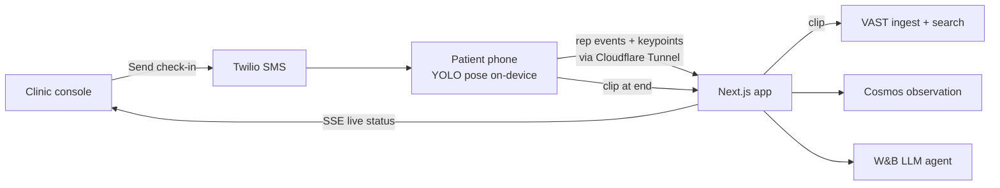

# Rise — Hackathon Build Plan

> Snapshot of the [live plan](https://claude.ai/code/artifact/dd20cc44-fbae-45d1-aa14-2fcd2f7f796a) (rev 51, Oct 9 team-of-two update). The live doc wins if they differ.

Sep 17, 2026 · @Rex Belgarde

## 1. Brief

Rise is a two-person, one-day build for the Real-Time Video Agents Hack – NYC (VAST Builders Challenge): two surfaces, a patient phone and a clinic console, built in seven hours on the provided Builders Stack plus three personal services.

| Input | Value |
| --- | --- |
| Hackathon | Real-Time Video Agents Hack – NYC, part of the VAST Builders Challenge ([event page](https://luma.com/vastnyc)) |
| Host and sponsors | tokens& with VAST Data, NVIDIA, SpaceXAI, CoreWeave, Weights & Biases |
| Date | About Oct 9, 2026 (registration closed Oct 2, one week prior); venue on approval |
| Build window | 9:30am build start → 12:30pm lunch → 4:30pm demos → 6:30pm awards; 7 hours including lunch |
| Team | Two people on two branches: Rex owns YOLO pose, the patient phone, and the deterministic rules (rex/pose); Jeremiah owns VAST, the video intelligence around it, and the clinic console (jeremiah/vast). See §6b |
| Official goal (verbatim) | "Build your own video agent or something no one's thought of. We'll share the videos to get you started on building video agents." |
| Judging criteria | Not published; seven judges listed. Plan assumes the rubric in §2 and that Builders Stack use is noticed. |
| Submission requirements | Not published; plan assumes in-room live demo plus GitHub repo with README. |
| Restrictions | None published. Pre-event work is limited to environment setup and seed data; confirm at the 9:00 keynote. |
| Prizes | 1st place NVIDIA DGX Spark; HuggingFace Microduck; Cursor credits; gift cards |
| Codebase | Start clean in the local `Rise` folder; seed data already in `Rise/seed/` |

Builders Stack (provided) and where Rise uses it:

| Layer | Provided as | Rise uses it for |
| --- | --- | --- |
| Video understanding | NVIDIA Cosmos, reasoning over a clip | One structured observation per session: compensations, steadiness, use of arms |
| Semantic search | Natural-language search for moments across hours of footage | Clinic console search across all check-ins: "times she pushed off the chair" |
| Object detection | YOLO, real-time detection and tracking across frames | Live pose keypoints → stand counting, arm-use and asymmetry |
| General-purpose LLMs | Weights & Biases models for application logic | The Rise agent: triage summary, routing, care-team note, patient message |
| Data layer | VAST AI OS orchestrates video ingestion and data | Session clips and keypoint streams land here; search runs over them |
| Compute and tooling | CoreWeave GPUs; Cursor | Model serving; build editor |

Personal services Rex brings: ElevenLabs (voice coach on the phone), Twilio (SMS check-in invites and the nurse callback), Cloudflare (HTTPS tunnel so a phone camera can reach the laptop; optional hosting).

The organizers' shared videos are general footage, not post-op patients. Rise uses them only to smoke-test the Cosmos and semantic-search adapters before the patient seed is wired.

Goal translated into a product outcome: a care team can see post-surgical mobility decline days before the scheduled visit, with less risk of a missed readmission signal, by having patients run a CDC-standard chair-stand test on their own phone while a video agent scores it live.

## 2. Option scoring and selection

Selected: Option A narrowed to a post-op mobility check-in (4.53 weighted). Backup: Option C, the exercise form trainer (3.93).

Scores are 1–5 per criterion, multiplied by weight. The theme is read as real-time video, which penalizes uploaded-recording workflows and rewards a live webcam moment.

| Criterion (weight) | A. Post-discharge video check-in | B. Home-care adherence | C. Exercise form trainer | A′ selected: post-op mobility check-in |
| --- | --- | --- | --- | --- |
| User impact (25%) | 5 → 1.25 | 4 → 1.00 | 3.5 → 0.88 | 5 → 1.25 |
| Demo clarity (20%) | 4 → 0.80 | 3.5 → 0.70 | 5 → 1.00 | 4.5 → 0.90 |
| Build feasibility (20%) | 3.5 → 0.70 | 3 → 0.60 | 4.5 → 0.90 | 4 → 0.80 |
| Meaningful AI use (15%) | 5 → 0.75 | 4 → 0.60 | 3 → 0.45 | 4.5 → 0.68 |
| Differentiation (10%) | 4 → 0.40 | 3.5 → 0.35 | 2 → 0.20 | 4.5 → 0.45 |
| Data/integration readiness (10%) | 3 → 0.30 | 3 → 0.30 | 5 → 0.50 | 4.5 → 0.45 |
| Weighted total | 4.20 | 3.55 | 3.93 | 4.53 |

Why the scores land where they do. Option A as first written (wound, mobility, and affect cues) has the strongest story but weak data readiness: wound imagery is hard to fake, hard to show, and Cosmos would be unproven on it in seven hours. Option B fails the one-workflow test: medication verification and PT verification are two pipelines, and pill detection with YOLO is a rabbit hole. Option C is the easiest to build and understand but is the most common pose-estimation hackathon demo, and its LLM coaching layer borders on decorative.

A′ keeps A's clinical differentiation and borrows C's engine: the agent guides a patient through sit-to-stand and arm-raise on their webcam, YOLO-pose tracks joints live, deterministic rules score time, symmetry, and range of motion against a discharge baseline, Cosmos writes the observation, and a nurse approves the escalation. Wounds and affect become non-goals.

Selection rule check for A′: demo clarity 4.5 (≥ 4), feasibility 4 (≥ 3.5), visible before/after (baseline vs. today), one primary user and one workflow, works on seeded keypoints if every service fails, one memorable moment (the escalation card resolving after a live sit-to-stand).

Backup rule: Option C uses the same pose pipeline with different copy and no patient context, so switching cost is under 30 minutes. Switch only if the static clinical slice is not navigable by 12:15.

Rescore after the Oct 7 scope change (patient phone + clinic console, STEADI protocol, Synthetic Hospital patients, full Builders Stack):

| Criterion (weight) | A′ single-screen | A″ two surfaces (current) | Why it moved |
| --- | --- | --- | --- |
| User impact (25%) | 5 → 1.25 | 5 → 1.25 | Unchanged |
| Demo clarity (20%) | 4.5 → 0.90 | 4.5 → 0.90 | Phone in hand + console tile turning red is still one story |
| Build feasibility (20%) | 4 → 0.80 | 3.5 → 0.70 | Second surface, live relay, phone camera over HTTPS |
| Meaningful AI use (15%) | 4.5 → 0.68 | 4.5 → 0.68 | Agent now routes as well as summarizes; still not decorative |
| Differentiation (10%) | 4.5 → 0.45 | 5 → 0.50 | Clinic watches a home test live; CDC-standard protocol |
| Data/integration readiness (10%) | 4.5 → 0.45 | 5 → 0.50 | Published synthetic charts + published test norms |
| Weighted total | 4.53 | 4.53 |  |

A″ holds the same total and still clears both thresholds, but feasibility now sits exactly on the 3.5 line. That is why §4 cuts hard and why the backup rule stays: if both surfaces are not navigable on seeded data by 12:15, drop to Option C on the phone surface alone.

Team-of-two update (Oct 9): a second builder lifts build feasibility from 3.5 to 4 (+0.10), so A″ now scores 4.63 and sits clear of the 3.5 line. The extra capacity goes to the Builders Stack, not new workflows: VAST semantic search moves from should-have to must-have and becomes a demo beat. The backup rule is unchanged.

## 3. Product concept

Pitch: Rise lets a care team send a post-surgical patient a 2-minute, CDC-standard chair-stand check-in to their phone, then watch a video agent score it live and route anything worrying to the right clinician the same day.

Rise is a standalone name. No CareBridge suffix appears in the UI, README, or pitch; the CareBridge platform is the "what's next" answer in Q&A.

Narrative. Today a patient discharged after a joint replacement or hip fracture gets a day-7 phone call where a nurse asks how the walking is going and hears "fine", and functional decline goes unseen until the next visit or the ED. With Rise, the clinic launches a check-in from its console; the patient gets a text, opens a link, props the phone on the floor, and a voice coach walks them through the CDC STEADI 30-Second Chair Stand while YOLO counts every stand and watches for arm use and weight shift. The agent combines those numbers, a Cosmos observation of the clip, and three tap-to-answer symptom questions into a triage card on the clinic's live board, and a coordinator approves the callback with one click.

Core hypothesis: if we give care teams a standardized, video-scored mobility test that patients can run at home on their own phone, then coordinators can catch post-op decline days before the scheduled visit, because a measured drop in stands or new reliance on the arms shows what "I'm fine" hides.

Two users, two surfaces:

| User | Surface | Job |
| --- | --- | --- |
| Patient after hip/knee surgery or hip fracture repair, 60–80, one phone, often alone | Mobile web link (no app install), portrait, large type, voice-led | Finish a safe 2-minute test without reading instructions |
| Care coordinator or post-acute nurse | Desktop clinic console | Launch check-ins, watch them live, review and act on triage cards |

Principles held for the build:

- One workflow across both surfaces: launch → test → triage card → approval.
- Standard, not invented: the test, its instructions, scoring rule, and norms come from CDC STEADI verbatim.
- Human control: the agent recommends and routes; a coordinator clicks every escalation. The one exception is a red-flag symptom, which shows the patient emergency instructions immediately.
- Evidence over claims: every flag links to a number, a frame, or the patient's own answer.
- Graceful failure: seeded sessions for all seven patients behind every live call.
- No dead ends: every screen on both surfaces has a next action.

## 4. MVP scope

The MVP is seven seeded patients, one CDC-standard test on the phone, one live board and one triage card in the console, and one approval. Everything else waits for Demo Lock.

### Guided-session protocol

The session is the CDC STEADI 30-Second Chair Stand ([CDC instructions](https://www.cdc.gov/steadi/media/pdfs/STEADI-Assessment-30Sec-508.pdf)), part of CDC's STEADI fall-prevention toolkit, which implements the American and British Geriatrics Societies' clinical practice guideline ([STEADI clinical resources](https://www.cdc.gov/steadi/hcp/clinical-resources/index.html)). The 30-second chair stand is also one of OARSI's recommended performance tests for hip and knee osteoarthritis ([OARSI performance measures](https://oarsi.org/research/physical-performance-measures)).

- Setup: straight-backed chair without armrests, seat about 17 in; phone propped side-on at floor level, whole body in frame.
- Patient instructions (spoken by the voice coach, CDC wording): sit in the middle of the chair; hands on the opposite shoulders, crossed at the wrists; feet flat; back straight, arms against the chest; on "Go", rise to full standing then sit back down, repeated for 30 seconds.
- Scoring (CDC rule, applied by YOLO keypoints): count full stands in 30 s; a stand more than halfway up at 30 s counts; if the patient must use their arms to stand, stop and record 0.
- Below-average (fall-risk) cutoffs by age: women 60–64 <12, 65–69 <11, 70–74 <10; men 60–64 <14, 65–69 <12, 70–74 <12.
- Add-on for one patient: STEADI 4-Stage Balance, tandem stance; under 10 s means increased fall risk ([CDC instructions](https://www.cdc.gov/steadi/media/pdfs/STEADI-Assessment-4Stage-508.pdf)).

Rise records two numbers per session: the official STEADI score (0 if arms used) and the raw stand count with arm-assisted reps flagged, so the trend stays visible for patients who still need their arms.

Adaptation to say out loud: STEADI tests are validated for in-clinic administration with the assessor standing beside the patient. Remote, phone-scored administration is not validated. Rise compensates by requiring a helper nearby, an armless chair against a wall, a stop button that is always on screen, and by comparing each patient mainly to their own prior check-ins.

### Demo patients

Seven patients from [Synthetic Hospital v1.3](https://github.com/sparkcpark/synthetic_hospital) (MIT license), chosen for lower-extremity surgery or hip fracture. Charts are copied unchanged; names, check-in history, and today's scripted session are Rise's overlay. Seed file: `Rise/seed/patients.json`.

| Rise ID | Name (synthetic) | Source ID | Age, sex | Episode | POD | Today: raw / STEADI | Expected triage |
| --- | --- | --- | --- | --- | --- | --- | --- |
| rise-01 | Ellen Marsh (hero) | 2842 | 65 F | Right TKA; warfarin, recurrent VTE | 3 | 3 / 0, arms from rep 2, short of breath | Escalate urgent → surgeon on call; patient sees emergency instructions |
| rise-02 | Judith Kerr | 2866 | 67 F | Left TKA; warfarin held | 7 | 6 / 6, 22% weight off left leg, calf pain | Escalate urgent → surgeon on call |
| rise-03 | Walter Brandt | 2218 | 70 M | Right TKA; orthostatic history, tamsulosin | 10 | 8 / 8, three post-stand pauses, dizzy | Nurse callback: orthostatic BP check |
| rise-04 | Gary Lindqvist | 2247 | 67 M | Total hip arthroplasty | 14 | 10 / 10 | Continue plan |
| rise-05 | Diane Coulter | 2856 | 62 F | Left TKA; diabetic polyneuropathy; episode reactivated by surgeon at 3-month visit | 90 | 11 / 11, tandem 4 s | Nurse callback → PT balance referral |
| rise-06 | Ruth Abernathy | 2857 | 72 F | Left femoral neck fracture repair | 21 | 6 / 0, arms every rep, rising from 4 | Continue plan with PT |
| rise-07 | Harold Pruitt | 2226 | 72 M | Right THA; mechanical valve on warfarin; episode reactivated by primary care | 120 | 6 / 6, shuffling, new incontinence | Escalate → primary care, not the surgeon |

Each scenario echoes the next real event in the source chart (for example, Ellen's chart has an ED visit for sudden shortness of breath on post-op day 4), so `expected_triage` doubles as the eval label set for the W&B run.

### Core journey

1. Launch (console): the coordinator selects Ellen Marsh and clicks Send check-in. Twilio texts her a link.
2. Prepare (phone): Ellen opens the link. The voice coach checks the chair, the helper, and framing, and YOLO running on her phone confirms her whole body is visible.
3. Test (phone): a voice-led 30-second chair stand with a live rep counter. The console tile shows "In progress" with the live count. If she stops early, the coach asks if she wants to keep going. If she declines or doesn't resume, the console asks a human to confirm whether it was a safety event.
4. Ask (phone): four tap questions: pain 0–10, dizziness, shortness of breath or chest pain, calf pain or swelling.
5. Close (phone): no score is shown. A trauma-informed message says whether today seemed easier, about the same, or harder than last time, what happens next, and that she's done.
6. Triage (console): the card shows her STEADI score vs. her history, the arm-use frame, asymmetry, the Cosmos observation, her answers, the rule that fired, and the agent's routing.
7. Act (console): the coordinator edits the note if needed and approves Escalate. Twilio texts the callback.

### Must-have

- [ ] Seed loaded: seven patients with history, scripted sessions, and patient-feedback trend
- [ ] Console: patient list with status, Send check-in, live board, triage card, approve action
- [ ] Phone: link landing, safety/setup check, voice-guided 30 s chair stand, four symptom taps, closing screen
- [ ] On-phone YOLO pose with stand counting, the CDC arm-use rule, and the half-way-at-30 s rule
- [ ] Stopped-early flow: offer to continue, then a human-confirm task on the console
- [ ] Patient never sees a score; closing message uses the better / same / harder library plus a closure line, then an optional note to the nurse
- [ ] Deterministic triage rules produce the recommendation; the agent writes the note and route
- [ ] Red-flag answer → patient sees emergency instructions immediately, no approval needed
- [ ] Live status from phone to console (in progress → scoring → ready); every session clip ingested to VAST and searchable from the console in plain language
- [ ] Seeded fallback session for every patient; "Demo data" badge when used
- [ ] Loading, empty, success, error states on both surfaces
- [ ] Reset demo

### Should-have, in order, only after Demo Lock clears

- [ ] Search results open the clip at the matched moment (search itself is now a must-have)
- [ ] 4-Stage Balance tandem test for Diane
- [ ] Twilio voice call for the callback (SMS is the must-have)
- [ ] Trend sparkline per patient
- [ ] Episode hand-off: FHIR bundle to the sandbox endpoint plus the secure episode link; billing-profile switcher; override reason picker

### Explicit cuts

- Native iOS/Android app — mobile web reaches the camera over HTTPS with zero install.
- Speech input from the patient — taps only; ElevenLabs speaks, it does not listen.
- Live ElevenLabs calls during the session — the coach lines are pre-generated mp3s; only the closing line is live.
- Timed Up and Go and the 3 m walk — needs room the demo stage may not have.
- Real auth or RBAC, EHR/FHIR write-back, scheduling, billing, analytics infrastructure, compliance infrastructure beyond an on-screen synthetic-data note.
- Wound, skin, affect, or medication assessment; multi-clinic tenancy; a custom design system.

## 5. UX plan

Two surfaces from one Next.js app: `/p/[token]` for the patient's phone and `/clinic` for the console. The judge moment lives on the console (C3), triggered from the phone (P3).

### Patient phone (mobile web, portrait)

Design rules for a 60–80-year-old alone with a phone: one action per screen, 20 px+ body and 56 px+ buttons, every instruction spoken by the voice coach and shown as a caption, high contrast, no scrolling during the test, a red Stop button always visible.

| Screen | Purpose | Components | Notes |
| --- | --- | --- | --- |
| P1. Welcome | Confirm who and why | Card, Button, Badge | "Hi Ellen, your care team at Riverside Ortho asked for a 2-minute check-in." Clinic name, synthetic-data badge, Start |
| P2. Safety and setup | Make the test safe and the camera usable | Checkbox, Alert, Progress | Three checks: armless chair against a wall, someone nearby, phone propped at floor level. Framing guide turns green when on-phone YOLO sees head to ankles. Model loads here, behind the checks |
| P3. Chair stand | Run the CDC test | Progress, Badge, Button | Voice: CDC instructions, countdown, "Go". Large rep counter, 30 s ring, skeleton overlay. If arms leave the chest, the coach says "Keep your arms crossed if you can", and the CDC rule is recorded. Stop is always visible |
| P3a. Paused | Stopped early | Card, Button | After Stop, or no stand for 8 s: "It's okay to pause. Would you like to keep going, or finish here?" Two equal buttons. Keep going resumes the timer. Finish here goes to P4 and flags the console for human confirmation |
| P4. Four questions | Capture symptoms | RadioGroup, Slider, Button | Pain 0–10; dizzy (yes/no); short of breath or chest pain (yes/no); calf pain or swelling (yes/no). Each one read aloud |
| P5. Closing | Close the loop without a score | Card, Alert | Trend message (easier / about the same / harder) + next step + closure statement, then an optional "Is there anything you'd like your nurse to know?" box (type, dictate with the keyboard mic, or skip). Red flag: full-screen emergency instructions instead, shown immediately |

### Patient feedback language

The patient never sees a STEADI score, a stand count, a norm, or words like "below average" or "fail". The closing screen compares today with their previous check-in (more stands with no new arm use = easier; fewer stands or new arm use = harder; otherwise the same) and is written to SAMHSA's six trauma-informed principles: safety; trustworthiness and transparency; peer support; collaboration and mutuality; empowerment and choice; cultural, historical, and gender issues ([CDC summary](https://www.cdc.gov/orr/infographics/6_principles_trauma_info.htm)).

Each closing screen is three lines, spoken and captioned: trend + next step + closure.

| Slot | Case | Line |
| --- | --- | --- |
| Trend | Easier | "You were able to do more today than last time. Your effort is showing." |
| Trend | About the same | "Today looked a lot like last time. Holding steady is a normal part of recovery." |
| Trend | Harder | "Today seemed harder than last time. That happens during recovery, and it helps your care team to know." |
| Trend | First check-in | "This was your first check-in, so today gives your care team a starting point." |
| Trend | Finished early | "You did what felt right for you today, and that's okay." |
| Next step | Continue plan | "Keep going with the plan you and your care team made." |
| Next step | Nurse callback | "A nurse from Riverside Ortho will call you today to check in. You can tell them anything you noticed." |
| Next step | Urgent | "Your care team would like to talk with you today. Please keep your phone nearby." |
| Next step | Finished early | "Someone from your care team will reach out to see how you're doing." |
| Closure | All | "Thank you for taking the time to do this. You're all done for today, and you can close this page whenever you're ready." |
| Emergency | Shortness of breath or chest pain = yes | "Because you told us you're short of breath or have chest pain, please call 911 now. If someone is with you, ask them to stay with you." Shown alone, no trend line |

Writing rules for any new line: name the feeling, not the person ("today seemed harder", not "you did worse"); always offer a choice where one exists; say exactly who will contact them and when; never blame ("you should have"); keep each line under 20 words and at about a 6th-grade reading level. The W&B agent drafts only the care-team note. Patient lines come from this table, so wording is fixed and reviewable.

Seed: `patient_feedback.trend_vs_previous` gives Ellen and Harold harder; Judith, Walter, and Diane the same; Gary and Ruth easier.

Optional note to the nurse: shown after the closure line, never required, voiced as "You can skip this." The note appears verbatim on the triage card, and the W&B agent summarizes it in the care-team note. A deterministic phrase screen (for example "chest pain", "can't breathe", "fell", "bleeding") turns the tile amber with "Note needs review" and creates a coordinator task. It does not trigger emergency instructions on its own, because the four symptom questions already cover that.

### Clinic console (desktop)

| Screen | Purpose | Components | Notes |
| --- | --- | --- | --- |
| C1. Patients | See the panel and launch | Table/DataTable, Badge, Button, Dialog | Seven rows: name, procedure, POD, last STEADI score, status. "Send check-in" opens a Dialog with protocol (preselected) and phone; sends Twilio SMS |
| C2. Live board | Monitor running agents | Card grid, Badge, Progress, Skeleton | One tile per active session: Invited → Setting up → Testing (live count) → Scoring → Ready. Tile turns red with icon + text on a red-flag answer |
| C3. Triage card | The judge moment | Card, Badge, Table, Dialog, Sheet, Textarea, Button | Top: recommendation + route ("Escalate urgent → surgeon on call"). Middle: STEADI score and raw count vs. history and age norm; arm-use frame; asymmetry. Side Sheet: Cosmos observation, patient answers, rule fired, agent's draft note. Bottom: Approve, Edit, Downgrade |
| C4. Search | Find moments across check-ins | Input, Card list | Should-have. "Show every time Ruth pushed off the chair" → clip thumbnails with timestamps |

Accessibility on both: labels on every input, visible focus, titled dialogs, status never by color alone, captions for every spoken line, errors that say what to do next.

## 6. Architecture and AI behavior

One Next.js app on the laptop serves both surfaces through a Cloudflare Tunnel. YOLO pose runs on the patient's phone in the browser, so the phone sends a few events per second, not video. Cosmos, semantic search, and the W&B LLM sit behind adapters with seeded fallbacks.

Stack: Next.js App Router, TypeScript, Tailwind, shadcn/ui, React Hook Form + Zod, Lucide, Sonner. State in memory, seeded from `seed/patients.json`; no database. Live updates by Server-Sent Events from the app to the console.

Why a tunnel: a phone browser only grants camera access on HTTPS. `cloudflared` gives the laptop a public HTTPS URL in one command, so the phone on cellular data reaches the app with no deploy. Running pose on the phone keeps the tunnel to small JSON events, so a weak connection slows the console's update, not the patient's counter.

Per-session flow:

1. On P2 the phone downloads an Ultralytics nano pose model exported to ONNX (`format="onnx"`, 320 px input, FP16, a few MB), cached after the first load, and runs it with ONNX Runtime Web: WebGPU where the phone supports it, WASM otherwise ([Ultralytics export modes](https://docs.ultralytics.com/modes/export/)).
2. Each frame yields 17 keypoints on the phone. A small state machine in the browser counts stands (hip height crossing a sit/stand band), flags arm use (wrists leaving the opposite shoulders), measures left/right knee-angle asymmetry, applies the CDC half-way-at-30 s rule, and detects a stop (Stop pressed, or no stand for 8 s).
3. The phone posts rep events and a downsampled keypoint stream (about 5 per second) to the app, which relays live status to the console by SSE.
4. The phone records the clip (MediaRecorder) and uploads it at the end; the app pushes it to VAST for storage and search.
5. Deterministic rules turn score, history, age norm, asymmetry, stop events, and answers into a recommendation and route.
6. Cosmos receives the clip and the computed numbers and returns a structured observation.
7. The W&B LLM agent drafts the care-team note and route explanation. The patient closing lines come from the fixed library in §5.
8. The card is pushed to the console; the coordinator approves; Twilio texts the callback.

Pose fallback ladder, tuned for smoothness: a 3-second benchmark on P2 keeps on-phone YOLO only if it holds 15 fps or more. Below that, Rise uses on-phone MediaPipe Pose Landmarker (Google's on-device body tracker: 33 landmarks in 2D and 3D, built for live camera feeds in the browser; Rise maps them to the same 17 points). MediaPipe is preloaded during setup, so if YOLO drops under 12 fps for 2 seconds mid-test, Rise swaps to MediaPipe without pausing the timer or the count. Next tier: the phone streams frames to `rise-pose` (YOLO on the laptop) through the tunnel. Last tier: seeded keypoint stream with the "Demo data" badge. The console tile shows which tier ran.

Why 15 fps and not 5: a chair stand in this population takes roughly 2–4 s, so even 5 fps gives about 10–20 frames per rep, enough to count. But a hand push-off lasts well under a second and can fall between frames, which would miss the CDC arm-use rule, and the skeleton overlay looks jerky to a patient watching it. These timings are estimates to confirm in the pre-event benchmark.

Triage rules (deterministic, run before any model):

| Rule | Fires when | Recommendation |
| --- | --- | --- |
| Red flag | Shortness of breath/chest pain = yes | Escalate urgent; patient sees emergency instructions immediately |
| Stopped early | Patient chose Finish here, or did not resume within 60 s of the continue prompt | Human confirm: console task "Was this a safety event?" → coordinator picks Safety event (escalate urgent + call now) or Not a safety event (score as partial, continue rules) |
| Clot signal | Calf pain/swelling = yes after lower-limb surgery | Escalate urgent → surgeon on call |
| Decline | Raw stands down ≥ 25% vs. last check-in, or new arm use | Escalate urgent → surgeon if POD ≤ 30, else primary care |
| Non-surgical pattern | Decline + new incontinence or shuffling gait | Escalate → primary care |
| Orthostatic | Dizzy = yes, or ≥ 2 post-stand pauses over 3 s | Nurse callback: orthostatic BP check |
| Balance | Tandem hold < 10 s | Nurse callback → PT |
| On track | None of the above | Continue plan |

Rules run top to bottom. A stop that resumes after the continue prompt is not a stop; the pause is logged on the card. A stopped-early session never shows a red tile on its own: it shows amber "Needs confirmation" until a human answers, and the four symptom questions still run, so a red-flag answer still wins.

Model jobs and guards:

| Component | Job | Guard | Fallback |
| --- | --- | --- | --- |
| YOLO pose (on phone) | Perception: keypoints, counting inputs, stop detection | Confidence floor; "Step back" prompt; kept only at 15 fps or more on P2; mid-test swap under 12 fps | MediaPipe on phone → laptop `rise-pose` → seeded stream |
| Cosmos | Observation JSON: `observation`, `compensations[]`, `steadiness`, `uncertainty` | Zod, one retry, 8 s timeout | Template sentence built from the numbers |
| W&B LLM agent | Care-team note, route explanation | Zod; cannot change the recommendation or any patient-facing line | Template note |
| VAST semantic search | Moment search across clips | 6 s timeout | Pre-indexed moments from the seed |
| ElevenLabs | Voice coach and closing lines | Every line pre-generated to mp3 before the event | On-screen captions only |
| Twilio | Invite SMS, callback | One retry | Link shown on the console as a QR code |

The recommendation never comes from a model. A hallucinated observation or note can change wording, never the escalation.

W&B Weave wraps the agent call so every session traces, and an eval scores the agent across all seven seeded sessions against `expected_triage`; that table is on screen in the architecture beat.

Repo layout: `app/clinic`, `app/p/[token]`, `lib/pose/{yolo-onnx,mediapipe,remote,seeded}.ts` (one interface, four tiers), `lib/pose/counter.ts` (stand state machine, arm-use, stop detection), `lib/rules.ts`, `lib/steadi.ts` (norms + scoring), `lib/feedback.ts` (patient line library), `lib/ai/{cosmos,agent,prompts}.ts`, `lib/adapters/{vast,twilio,elevenlabs}.ts`, `public/models/pose.onnx`, `public/voice/*.mp3`, `services/rise-pose/` (laptop fallback), `seed/`.

## 6a. Monitoring episode and check-in cadence

A Rise monitoring episode lasts 30 days from discharge by default and fills the gaps between in-person care; it never replaces a visit. Clinics can reactivate a new 30-day episode for an existing patient at any time, and clinicians can override every default.

### Checking the 30-day and 2–4-week assumptions

| Assumption | What the standards say | Verdict |
| --- | --- | --- |
| Monitoring should cap at 30 days | TEAM, mandatory for selected hospitals Jan 2026–Dec 2030, holds hospitals accountable for 30 days after discharge for joint replacement and hip/femur fracture ([AAPM&R](https://aapmr.org/quality-practice/quality-reporting/alternative-payment-models/team)). TCM is one 30-day period from discharge ([CMS MLN](https://www.cms.gov/files/document/mln908628-transitional-care-management-services.pdf)). RTM is counted per 30-day period. | Supported. 30 days is the natural unit for accountability, billing, and readmissions |
| Patients see someone in person 2–4 weeks after discharge | One large system's knee pathway: PA visit at 2 weeks, surgeon at 6 weeks, outpatient PT from week 3 ([Kaiser Permanente](https://wa.kaiserpermanente.org/static/pdf/public/health-wellness/joint-replacement/knee-timeline.pdf)). TCM requires a face-to-face visit within 7 or 14 days. An expert consensus recommends outpatient rehab within 1 week of TKA, twice a week for the first month ([JOSPT 2023](https://www.pubmed.ncbi.nlm.nih.gov/37428802/)). | Mostly right, with a correction: the first clinician visit is usually at about 2 weeks (the early end of your range), and most patients are also in PT once or twice a week. Rise covers the days between PT sessions and visits. The surgeon's 6-week visit falls after the episode closes, so the episode summary is written for it |
| The day-2 contact can be billed as TCM | CMS: TCM can't be billed if any of the 30 days falls inside a global surgery period for a procedure billed by the same practitioner ([CMS MLN](https://www.cms.gov/files/document/mln908628-transitional-care-management-services.pdf)). Major surgery carries a 90-day global period that already includes follow-up visits ([CMS global surgery booklet](https://www.cms.gov/files/document/mln907166-global-surgery-booklet.pdf)). | Correction: the surgeon's practice can't bill TCM for these patients. TCM belongs to primary care or another practitioner. The day-2 call is still standard care; one pathway's nurse navigator calls on days 1 and 2 |
| Remote monitoring can be billed during the global period | A practitioner who bills a surgery with a global period can't bill Medicare for RPM or RTM to that patient during the global period. RTM can run alongside TCM (not RPM and RTM together) if time isn't counted twice. PTs can bill RTM done by PTAs under general supervision since 2024 (\[Foley & Lardner\](https://www.foley.com/insights/publications/2023/11/top-5-rules-medicare-2024-rpm-rtm)). | Correction: not by the surgeon. In a surgical practice, RTM is billed by the physical therapist under the PT plan of care. Rise defaults to that profile (below). Rules summarized from the 2024 fee schedule; recheck against 2026 before go-live |

### Workflow

1. Discharge starts the episode (day 0).
2. Day 1–2: a nurse always places a phone call. Rise sends the first check-in link after that call.
3. Days 2–14: check-in every 2 days, plus one the day before the first in-person visit (usually around day 10–14).
4. Days 15–30: every 3 days; extended to 4 after two check-ins in a row that were the same or easier.
5. Result modifiers: escalation pauses the schedule until a clinician clears the patient, then a recheck next day; nurse callback means a recheck within 2 days; a harder session halves the interval; stopping early (confirmed not a safety event) changes nothing.
6. Missed check-in: reminder text at +24 h; two misses in a row create a coordinator task.
7. Day 30: the episode closes, no more links are sent, and a summary goes to the treating clinician ahead of the 6-week visit by both hand-off routes below.
8. Reactivation: any clinician can start a new 30-day episode with a reason (for example a new fall or a complaint at a visit), with a weekly default cadence or their own.

The default gives 12 data days in 30, inside the 2–15-day band of RTM code 98985.

### Clinician control

Every number above is a Rise default, labeled as a default in the UI, never as a clinical standard. Clinics set their own protocol, clinicians can override per patient, and every change is logged with who, when, and a reason picked from a short list, and shown as a chip on the patient ("Cadence: clinician override").

| Setting | Rise default | Who can change it |
| --- | --- | --- |
| Episode length | 30 days | Clinic admin; clinician per patient |
| Cadence | Every 2 days to day 14, then every 3 | Clinic admin; clinician per patient |
| Day-2 contact | Nurse phone call, always | Clinic admin chooses who calls; it can't be turned off |
| Escalation thresholds | Decline ≥ 25%, tandem < 10 s, ≥ 2 pauses over 3 s, CDC age norms | Clinic medical director |
| Routing | Surgeon on call within 30 days of surgery, else primary care | Clinic admin |
| Add-on tests | Off (balance on for selected patients) | Clinician per patient |
| Patient feedback lines | Library in §5 | Clinic admin, from an approved list |

### Override reasons

Every override asks for one reason from a short list. "Other" requires free text, and an optional note is allowed on any reason.

1. Patient preference or burden
2. Clinical condition calls for closer monitoring
3. Clinical condition calls for less monitoring
4. Surgeon- or procedure-specific protocol
5. Aligning with PT sessions or in-person visits
6. Device, connectivity, or access issue
7. Caregiver or helper availability
8. Other (free text required)

The log stores setting, old value, new value, reason code, free text, user, and timestamp, and exports as CSV for quality review.

### Billing profile by clinical team

When a clinic is set up, Rise asks what kind of team it is and turns on the billing model that team is most likely able to use. Users can switch profiles or build a custom one in settings. The counters on the monitoring summary follow the active profile.

| Clinical team | Default billing model | Rise counts | Why this default |
| --- | --- | --- | --- |
| Orthopedic surgical practice (default for Rise's first customer) | RTM billed by the practice's own or partnered physical therapist under the PT plan of care: 98975, 98985 or 98977, 98979/98980/98981. Surgeon and PA follow-up stays inside the 90-day global. If the partner hospital is in TEAM, the episode metrics support collaborator gainsharing | Data days, PT management minutes, interactive calls, TEAM episode day | The surgeon can't bill TCM, RPM, or RTM during the global period; the PT can |
| Primary care practice | TCM (99495/99496) plus RTM concurrently, time not double-counted | TCM contact and face-to-face dates, data days, minutes | PCP isn't under the surgical global |
| Outpatient PT clinic | RTM, with PTAs under general supervision | Data days, minutes, calls | Fits the PT plan of care |
| TEAM hospital (care transitions team) | No per-service code; 30-day episode spend, readmissions, patient-reported outcomes | Episode day, escalations, ED visits avoided (self-reported) | TEAM pays on the episode, not on services |
| Custom | Clinic chooses codes and thresholds | As configured | For payers or contracts outside Medicare FFS |

### Episode hand-off: two routes

When an episode closes, or a clinician clicks Send summary, Rise sends the same summary two ways.

| Route | What is sent | Where |
| --- | --- | --- |
| 1. FHIR to the designated EHR | A FHIR R4 transaction Bundle: one Observation per check-in (STEADI score, raw stands, arm use, asymmetry as components), and a DocumentReference holding the episode summary note with links to each session video. Escalations add a Task for the follow-up call | Clinic-configured FHIR base URL, authenticated with SMART Backend Services. Each clinic designates its EHR in settings |
| 2. Secure link | Episode page: summary, check-in table and trend, each session's video stored in VAST with its Cosmos observation and evidence frames, patient notes, calls, overrides log | Single-use, expiring link sent to the treating clinician; opens behind clinic sign-in in production |

Demo version: Rise reads each patient's chart from the Synthetic Hospital FHIR R4 simulator (`epic_sim`, read endpoints for Patient, Condition, MedicationRequest). That simulator has no write endpoints for Observation or DocumentReference, so Rise posts the bundle to a built-in FHIR sandbox endpoint that validates it and shows "Delivered to EHR (sandbox)", with a Download bundle button. Real EHR connections (Epic, Oracle Health) and production auth are post-hackathon. The LOINC code for the 30-second chair stand Observation is to be confirmed before production; the demo uses a local code with display text.

### Monitoring summary on the console

Each patient has a 30-day summary: data days against the 2–15 band, management minutes against the 10- and 20-minute thresholds, two-way calls, in-person visits attended and upcoming, and code eligibility marked as counts only. A preview mockup is in `Rise/design/monitoring-summary-preview.html`. For the demo it stays one click away from the triage card, not on the main path.

Seed (`monitoring_episode` and `cadence` in `patients.json`): five patients are in their post-discharge episode on days 1–16. Diane (episode day 6) and Harold (day 8) are in reactivated episodes, each traced to a source-chart encounter at 3 and 4 months. Ellen, Judith, and Harold recheck the day after clearance; Walter and Diane within 2 days of their callback; Gary in 2 days; Ruth in 4.

Caveats for Q&A: CMS requires an RTM device to meet FDA's definition of a medical device, so whether Rise qualifies needs regulatory review. Medicare Advantage and commercial payers set their own rules. Rise counts data days, minutes, and calls; the practice's compliance team decides what to bill.

## 6b. Team of two: ownership, branches, and merges

Rex owns everything that turns a body on camera into numbers and a decision: YOLO pose, the patient phone, and the deterministic rules. Jeremiah owns everything that turns a stored clip into understanding and puts it in front of the clinic: VAST, Cosmos, the W&B agent, the live relay, and the console. Each person owns one surface end to end, so neither waits on the other to demo their half.

### Ownership

| Area | Owner | Files | Why it sits there |
| --- | --- | --- | --- |
| YOLO pose on the phone (ONNX, WebGPU/WASM) | Rex | `lib/pose/yolo-onnx.ts` | Assigned |
| MediaPipe fallback, tier selection, laptop `rise-pose` | Rex | `lib/pose/mediapipe.ts`, `lib/pose/select.ts`, `services/rise-pose/` | Same perception layer |
| Stand counter, arm use, stop detection, asymmetry | Rex | `lib/pose/counter.ts` | Consumes keypoints directly |
| Fixtures recorder and seeded replay | Rex | `app/dev/pose/`, `lib/pose/seeded.ts`, `fixtures/` | Records Rex's own movement |
| Patient phone P1–P5, P3a, voice playback, closing lines, note box | Rex | `app/p/**`, `lib/feedback.ts`, `public/voice/` | The camera lives on this surface |
| Triage rules and cadence | Rex | `lib/rules.ts`, `lib/cadence.ts` | Rules read the counter's output; Rex defines `SessionResult` |
| Twilio invite and callback | Rex | `lib/adapters/twilio.ts` | The SMS link opens the phone flow |
| VAST ingest and semantic search | Jeremiah | `lib/adapters/vast.ts`, `app/api/sessions/[id]/clip/` | Assigned |
| Cosmos observation | Jeremiah | `lib/ai/cosmos.ts`, `lib/ai/prompts.ts` | Reasons over the clip Jeremiah stores in VAST |
| W&B agent, Weave tracing and eval | Jeremiah | `lib/ai/agent.ts` | Writes the note that sits next to the Cosmos observation |
| Session store and SSE relay | Jeremiah | `lib/sessions.ts`, `app/api/sessions/**` | The server end of every clip and event |
| Clinic console C1–C4 and monitoring summary | Jeremiah | `app/clinic/**` | Displays what the relay, Cosmos, agent, and search produce |
| FHIR hand-off (should-have) | Jeremiah | `lib/adapters/fhir.ts`, `app/api/fhir-sink/` | Packages the console's episode summary |
| Shared contracts | Both, via small PRs to main | `lib/types.ts`, `config/protocol.default.json` | Change only by PR; the other person rebases right away |

Workload check: Rex about 6 hours (pose 3, phone 1.5, rules and cadence 1, Twilio 0.5); Jeremiah about 6.25 hours (VAST 1.5, Cosmos 1, agent and Weave 1, relay 0.75, console 1.5, search UI 0.5). The riskiest item each person owns (on-phone YOLO; the VAST API, which is unknown until 9:00) starts first.

### Branches and merges

- 9:30: both pull main. Before branching, one 20-minute PR to main pins the contracts in `lib/types.ts`: `SessionResult`, `RepEvent`, `TriageCard`, plus Jeremiah's new `ClipRef` and `SearchHit`. Then branch `rex/pose` and `jeremiah/vast`.
- Main is protected by CI (typecheck, tests, lint, build). Merge only green PRs.
- Merge to main at each checkpoint (12:15, 2:45, 3:45), with a 10-minute integration run on the phone and projector right after. Small PRs in between are fine if they touch only your own files.
- Seams, and how each side works before the other lands:
  - Phone → relay: Rex posts `RepEvent`s to `POST /api/sessions/[id]/events`. Until Jeremiah's route merges, Rex logs to the console in the browser.
  - Phone → VAST: the phone uploads the clip to `POST /api/sessions/[id]/clip`. Until then, Rex saves it locally; Jeremiah tests ingest with the organizers' videos and Rex's three fixture clips.
  - Rules → console: Jeremiah renders `TriageCard` from each patient's `scripted_today` and `expected_triage` until `lib/rules.ts` merges at 2:45.
  - Cosmos → rules: Cosmos never changes the recommendation, so the two can merge in either order.

### Per-person checklist

Rex (`rex/pose`)

- [ ] On-phone YOLO with WebGPU → WASM; 15 fps keep rule
- [ ] MediaPipe tier, mid-test swap under 12 fps, tier reported
- [ ] Counter: stands, CDC arm rule, half-way rule, stop at 8 s, asymmetry; tests
- [ ] Fixtures recorder and seeded replay for rise-01, rise-02, rise-06
- [ ] Phone P1–P5 and P3a with voice and captions; no scores anywhere
- [ ] `lib/rules.ts` matching the oracle on all 7 patients plus stopped-early
- [ ] `lib/cadence.ts` matching `seed/build_seed.py`
- [ ] Twilio invite and callback, QR fallback
- [ ] Plays Ellen on stage; owns the phone and chair setup

Jeremiah (`jeremiah/vast`)

- [ ] VAST ingest: clip upload route, storage, fallback to local file
- [ ] VAST semantic search across sessions, with pre-indexed seed moments as fallback
- [ ] Session store and SSE relay; console tiles update within 1 s
- [ ] Console C1 patient list + Send check-in, C2 live board, C3 triage card, C4 search
- [ ] Cosmos adapter with Zod, retry, timeout, template fallback
- [ ] W&B agent with Weave tracing; eval over 7 seeded sessions
- [ ] Monitoring summary panel (from the preview mockup) one click from C3
- [ ] Drives the console on stage; owns the backup screen recording

### Who asks what at 9:00

Jeremiah asks for VAST and Cosmos endpoints, keys, and the shared videos. Rex asks for W&B inference details and the pre-built-code rule. Whoever learns something that changes the plan posts it in the team chat before 9:30.

## 7. Phased checklist and timeline

Each person starts with their riskiest piece: Rex with YOLO pose inside the phone's browser, Jeremiah with the VAST API. Owners for every checklist item below are in §6b. Both surfaces must work on seeded data by 12:15, and Demo Lock is 3:45pm.

| Time | Rex (rex/pose) | Jeremiah (jeremiah/vast) | Together / gate |
| --- | --- | --- | --- |
| Oct 9 evening | Pose ONNX export and phone fps benchmark; three fixture clips; ElevenLabs mp3s; Twilio verified | Read the VAST, Cosmos, and W&B docs available before the event; clone the repo, `npm run check` | Repo pushed; CI green |
| 9:00 | Ask about W&B inference and pre-built code | Ask about VAST and Cosmos endpoints and the shared videos | Keynote |
| 9:30–10:00 | Tunnel up; `/p/rise-01` opens on the phone | Organizers' videos downloaded; VAST credentials working | Contracts PR to main, then branch |
| 10:00–12:15 | YOLO, MediaPipe, tier switch, counter, fixtures; then P1–P3 | VAST ingest with organizers' videos and fixture clips; session store + SSE; console C1–C2 on seed | **Checkpoint 1 — Static Demo at 12:15:** merge both; backup decision |
| 12:15–1:00 | Phone posts live events | Board shows live count | Lunch + integration: live count on the projector |
| 1:00–2:45 | Rules, cadence, feedback; P3a, P4, P5; Twilio | Clip upload to VAST; search (C4); Cosmos; W&B agent; triage card C3 | **Checkpoint 2 — Live Capability at 2:45:** merge both |
| 2:45–3:45 | Phone states, stage-light test, fixtures replay check | Console states, Weave eval, monitoring summary, projector test | **Checkpoint 3 — Demo Lock at 3:45:** final merge |
| 3:45–4:30 | Rehearse the chair stand and phone flow | Backup screen recording first, then README and screenshots | Two timed rehearsals together |

Phase 0 — Decision and setup

- [x] Inputs gathered
- [x] Options scored, primary and backup selected
- [x] Pitch written, journey defined
- [x] Repo `rise` initialized
- [x] Seven-patient seed built from Synthetic Hospital (`seed/patients.json`), with patient-feedback trend
- [x] Guided-session protocol chosen: CDC STEADI 30-Second Chair Stand
- [x] Patient feedback language library written (§5)
- [ ] Cloudflare Tunnel: phone camera works over HTTPS on cellular
- [ ] Pose model exported to ONNX; on-phone fps measured for WebGPU and WASM
- [ ] MediaPipe Pose Landmarker tier runs on the same phone
- [ ] ElevenLabs: coach lines and the 11 closing lines rendered to `public/voice/`
- [ ] Twilio: number active, test SMS received on Rex's phone
- [ ] Fallback keypoint recordings for rise-01, rise-02, rise-06
- [ ] Phone stand or tripod and an armless chair for the stage

Phase 1 — Static vertical slice

- [ ] App shell with `/clinic` and `/p/[token]`
- [ ] C1 patient list from seed with Send check-in dialog
- [ ] C2 live board tiles on seeded states, including amber "Needs confirmation"
- [ ] C3 triage card in final layout on Ellen's scripted session
- [ ] P1–P5 and P3a phone screens at 390 px width with captions
- [ ] On-phone pose → live counter, arm-use, stop detection on Rex's phone
- [ ] Full flow navigable with no live AI

Phase 2 — Core intelligence

- [ ] `lib/steadi.ts`: norms table, arm-use rule, half-way rule
- [ ] `lib/pose`: four tiers behind one interface; tier shown on the console
- [ ] `lib/rules.ts`: eight rules incl. stopped-early, unit-tested on all seven patients plus a stopped-early case
- [ ] `lib/feedback.ts`: trend + next step + closure; emergency override
- [ ] Human-confirm task on the console for stopped-early sessions; \`lib/cadence.ts\` next-check-in engine with clinic- and patient-level protocol overrides, audit log, and 30-day episode close/reactivate; optional patient note with phrase screen
- [ ] SSE live status phone → console
- [ ] Cosmos adapter with Zod, retry, timeout, fallback
- [ ] W&B LLM agent with Zod and template fallback; Weave tracing
- [ ] VAST clip upload (fallback: local file)
- [ ] Twilio invite and callback SMS (fallback: QR on console)
- [ ] Red-flag path shows emergency instructions on the phone

Phase 3 — Product polish

- [ ] Loading, empty, success, error states on both surfaces
- [ ] Weave eval: agent vs. `expected_triage` for all seven
- [ ] Evidence frame and Cosmos sheet on C3
- [ ] Phone test under stage lighting at floor level
- [ ] Projector test of the console at 1280×720
- [ ] Reset demo clears sessions and reloads seed

Phase 4 — Submission and demo prep

- [ ] Backup screen recording of phone + console side by side
- [ ] README (pitch, problem, user, solution, demo link, screenshots, architecture, stack, setup, env vars, scenarios, limitations, roadmap, credits)
- [ ] Credit Synthetic Hospital and CDC STEADI in the README and on the console footer
- [ ] Demo script rehearsed twice with a timer
- [ ] Feature freeze

Checkpoints: Concept Lock (this doc) → Static Demo 12:15 → Live Capability 2:45 → Demo Lock 3:45. After Demo Lock: fix defects and clarify copy only; no new workflows, no dependency swaps, no interface redesign.

## 8. Acceptance criteria

The build is done when every item below holds with the phone on cellular data, and again with every external service turned off.

Product

- [ ] A coordinator goes from Send check-in to an approved escalation in under three minutes, including the patient's test
- [ ] A patient finishes the phone flow without reading anything: every step is spoken and captioned
- [ ] Scoring matches the CDC rule: arms used → STEADI score 0, raw count kept
- [ ] No score, count, or norm ever appears on the phone; every closing screen is trend + next step + closure from the library
- [ ] Stopping early always offers "keep going" first, and an unresumed stop always creates a human-confirm task
- [ ] A red-flag answer shows emergency instructions on the phone immediately
- [ ] A human clicks every escalation on the console

Engineering

- [ ] Rules produce the `expected_triage` recommendation for all seven seeded patients, and a human-confirm task for a stopped-early test (unit tests)
- [ ] On-phone YOLO holds 15 fps or more on Rex's phone, or MediaPipe takes over at setup or mid-test with no visible stutter, and the console shows the tier
- [ ] Cosmos, W&B, VAST, Twilio each fail cleanly to their fallback within their timeout
- [ ] Console shows the live count within 1 s of the phone
- [ ] Weave trace for one full session and an eval table over seven

Design

- [ ] Phone usable at 390 px width, one hand, 56 px+ buttons, Stop always visible
- [ ] Status never by color alone on either surface
- [ ] Console legible on a projector at 1280×720

Demo

- [ ] Two timed rehearsals with phone on a stand and laptop on the projector
- [ ] Backup recording plays without the app running
- [ ] Judge moment lands by 2:15
- [ ] Reset demo returns both surfaces to the start in one click

## 9. Demo script

About 3:30 on two screens: the console on the projector, Rex's phone on a floor stand pointed at an armless chair. Rex plays Ellen Marsh on the phone; Jeremiah drives the console on the projector and narrates the search and stack beats. The judge moment is Ellen's tile turning red on the projector while Rex is still sitting in the chair.

| Time | Beat | What happens on stage |
| --- | --- | --- |
| 0:00–0:25 | Problem | "After a knee replacement, the day-7 call hears 'I'm fine.' Then some of those patients show up in the ED." |
| 0:25–0:45 | Launch | Console: seven post-op patients from a synthetic hospital. Click Ellen, Send check-in. Phone buzzes on stage with the text. |
| 0:45–1:45 | Patient test | Rex opens the link; the voice coach reads the CDC instructions; he does the chair stand, pushes off with his hands from rep 2. YOLO runs on the phone itself; the console tile shows the live count. Rex taps the questions and says yes to shortness of breath. |
| 1:45–2:15 | Judge moment | Phone flips to emergency instructions. Console tile turns red: "Escalate urgent → surgeon on call. 3 stands vs 5 at discharge; arms used; shortness of breath; on warfarin with recurrent VTE." |
| 2:15–2:40 | Trust | Open the card: arm-use frame, Cosmos observation, the rule that fired, agent's note. Approve; Twilio sends the callback text. |
| 2:40–3:05 | Range | Jeremiah types "every time a patient pushed off the chair" into search; VAST returns Ellen's and Ruth's moments with timestamps. Then Harold's card: the agent routes his decline to primary care, not the surgeon. |
| 3:05–3:30 | Stack and close | Diagram: YOLO live, Cosmos, W&B agent and its eval over seven patients, VAST search, CoreWeave. "CDC test, any phone, live to the care team." |

Mention once, plainly, that Ellen's source chart records an ED visit for shortness of breath on post-op day 4: that is why her scenario exists. Do not claim Rise detects a clot.

If the phone camera fails: flip the "Use demo recording" switch on the phone, say so, and keep going.

## 10. Judge Q&A prep

Every answer points at something on screen.

| Likely question | Answer |
| --- | --- |
| Why is AI necessary? | YOLO turns a phone video into a CDC score with no clinician present; Cosmos describes how the patient moved; the agent writes the note and picks the team. Without them this is a phone call. |
| Is the test validated for home use? | The 30-second chair stand is validated in clinic (CDC STEADI; OARSI). Remote phone scoring is not validated yet; Rise compares patients mainly to themselves, requires a helper nearby, and treats the score as a trigger for a human call, not a diagnosis. |
| Why don't patients see their score? | A number and an age norm read as pass/fail to someone recovering slowly. Patients get trauma-informed language instead (easier, same, or harder than last time, what happens next, and a closing line). The care team sees the numbers. |
| What if someone stops halfway? | Rise asks if they'd like to keep going. If they finish there, a human on the console confirms whether it was a safety event before anything else happens. A stop alone never auto-escalates. |
| Why run YOLO on the phone? | The counter keeps working on a weak connection, video never streams live, and the server only gets small events. If the phone is too slow, Rise drops to MediaPipe, then to YOLO on the laptop, and shows which tier ran. |
| How reliable is it? | Recommendations come from eight written rules, unit-tested on seven patients. Models only describe and explain. Every service has a fallback I can show by turning it off. |
| What is real and what is simulated? | Patients are synthetic, from Synthetic Hospital (MIT). The CDC protocol is real and quoted. The pose tracking on stage is live, on my phone. |
| What if the model hallucinates? | It cannot escalate, and it never writes to the patient. Only measured numbers and the patient's own answers trip a rule. |
| Is a phone safe for a frail patient? | Setup requires an armless chair against a wall and a helper; Stop is always on screen; a red-flag answer shows emergency instructions without waiting for anyone. |
| Privacy? | Demo uses synthetic data. Pose runs on the device; only the finished clip is uploaded, to the clinic's VAST tenant; links are single-use tokens, no app install. |
| Who adopts this? | Orthopedic bundled-payment programs and post-acute teams already paying nurses to make follow-up calls. |
| Why not a native app? | Patients this age won't install one for a 2-minute test. A texted link reaches the camera with nothing to download. |
| What's next? | Timed Up and Go and the balance test, voice answers through CareBridge Voice, EHR write-back. |
| How does it scale? | Pose compute is on the patient's phone; Cosmos and the agent run once per session, not per frame. |
| Does this replace follow-up visits? | No. It runs for 30 days between the day-2 nurse call, PT sessions, and the 2-week visit, then hands a summary to the 6-week visit. Clinics can reactivate it, and every default can be overridden by the clinician. |
| Can the surgeon bill TCM for this? | No, and not RTM either: CMS doesn't pay TCM, RPM, or RTM to the practitioner who billed the surgery during its 90-day global period. In a surgical practice, the physical therapist bills RTM, which is Rise's default billing profile for that team. Rise counts data days, minutes, and calls; the practice's compliance team decides what to bill. |

## 11. Post-hackathon opportunities

Ideas cut from scope live here; nothing on this list enters the build before Demo Lock clears.

- STEADI Timed Up and Go and full 4-Stage Balance on the phone
- Spoken symptom answers through CareBridge Voice (speech-to-text + ElevenLabs conversational agent)
- Validation study: phone-scored vs. clinician-scored 30-second chair stand
- Twilio voice call bridging the nurse straight to the patient
- Caregiver view and reminders
- FHIR/EHR write-back of STEADI scores as Observations
- Native app with on-device pose for offline homes
- Gait analysis from a hallway walk; wound photo assessment
- RehabNinja XP shop, multi-character dojo, and live acl-rehab-ai session sync on player home

## Sources

- CDC STEADI, [30-Second Chair Stand instructions](https://www.cdc.gov/steadi/media/pdfs/STEADI-Assessment-30Sec-508.pdf)
- CDC STEADI, [4-Stage Balance Test instructions](https://www.cdc.gov/steadi/media/pdfs/STEADI-Assessment-4Stage-508.pdf)
- CDC STEADI, [Timed Up and Go instructions](https://www.cdc.gov/steadi/media/pdfs/STEADI-Assessment-TUG-508.pdf)
- CDC, [STEADI clinical resources](https://www.cdc.gov/steadi/hcp/clinical-resources/index.html)
- OARSI, [Physical performance measures](https://oarsi.org/research/physical-performance-measures)
- Park, Chen, Dettmers, [Synthetic Hospital v1.3](https://github.com/sparkcpark/synthetic_hospital), MIT license
- tokens&, [Real-Time Video Agents Hack – NYC](https://luma.com/vastnyc)

Added Oct 7: [Noridian Medicare, TCM](https://med.noridianmedicare.com/web/jfb/specialties/care-coordination/transitional-care-management-tcm) · [Force Therapeutics, 2026 RTM codes](https://www.forcetherapeutics.com/blog/cms-updates-remote-therapeutic-monitoring-rtm-codes-in-the-2026-physician-fee-schedule) · [AAPM&R, TEAM](https://aapmr.org/quality-practice/quality-reporting/alternative-payment-models/team) · [Google, MediaPipe Pose Landmarker](https://developers.google.com/edge/mediapipe/solutions/vision/pose_landmarker) · [Ultralytics, export modes](https://docs.ultralytics.com/modes/export/) · [CDC, six trauma-informed principles](https://www.cdc.gov/orr/infographics/6_principles_trauma_info.htm)
